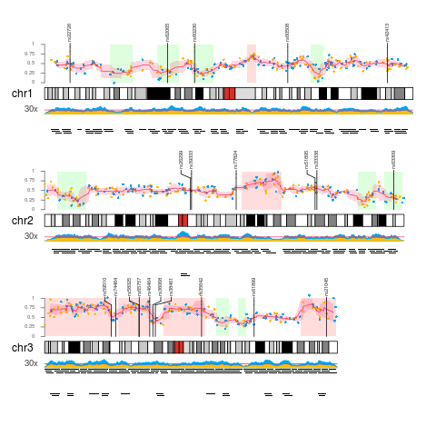
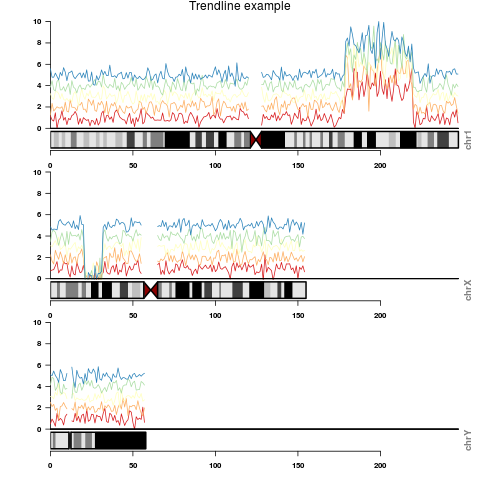
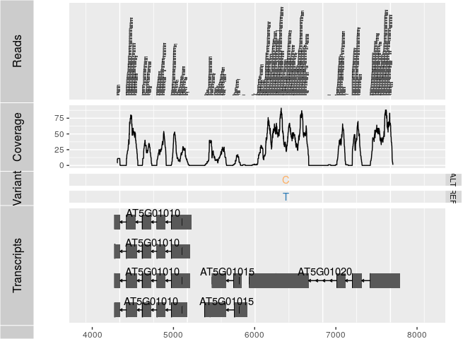

## R/Bioconductor packages for chromosome-wide visualization

We discuss 3 R/Bioconductor packages that can be used to visualize genome-wide data (e.g. methylation data, density of CpG islands, differential expression, GWAS results, ...):
KaryoploteR, ggbio and IdeoViz.  
  
Genome-wide visualization allows a) to identify distinctive spatial distribution, b) highlight distribution differences between samples/treatments and c) to confirm consistency across genome (e.g. that there are no foci and the change is global).  
  
  
### KaryoploteR

https://bernatgel.github.io/karyoploter_tutorial/

- plots with nice aesthetics
- good documentation
- requires R version >= 3.4

  
(Code: https://bernatgel.github.io/karyoploter_tutorial/Examples/MultipleDataTypes/MultipleDataTypes.html)

#### Many different types of plots
kpPlotBAMDensity   kpPlotGenes        kpPlotMarkers      kpPlotRegions  
kpPlotCoverage     kpPlotLinks        kpPlotNames        kpPlotRibbon  
kpPlotDensity      kpPlotLoess        kpPlotRainfall     kpPlotTranscripts    


#### Installation
source("https://bioconductor.org/biocLite.R")  
biocLite("karyoploteR")


-------------------------------------------
### IdeoViz

https://www.bioconductor.org/packages/release/bioc/html/IdeoViz.html



more examples:
https://www.bioconductor.org/packages/release/bioc/vignettes/IdeoViz/inst/doc/Vignette.pdf


#### Installation
source("https://bioconductor.org/biocLite.R")  
biocLite("IdeoViz")  

----------------------------------------------

### ggbio

https://bioconductor.org/packages/release/bioc/html/ggbio.html

  
(Code: http://girke.bioinformatics.ucr.edu/CSHL_RNAseq/mydoc/mydoc_Rgraphics_7/)
  
  
- syntax like ggplot2
- organized by tracks: ideogram track, gene model track, alignment track (read coverage), variants tracks 
- flexible (linear + circular plots, karyograms, Manhattan plots, ...)

More examples   
- http://www.sthda.com/english/wiki/ggbio-visualize-genomic-data  
- http://rstudio-pubs-static.s3.amazonaws.com/9418_48ced8100f784734be7541bdda5da402.html#/20  

#### Installation  
source("http://www.bioconductor.org/biocLite.R")  
biocLite("ggbio")  


### Exercises

1. Work through the [GeneDensity example](https://bernatgel.github.io/karyoploter_tutorial//Examples/GeneDensity/GeneDensity.html) of the karyoploteR package    
2. Work through example 1 of IdeoViz with simulated data[Vignette](https://www.bioconductor.org/packages/release/bioc/vignettes/IdeoViz/inst/doc/Vignette.pdf)
```{r}
library("IdeoViz")
data(binned_multiSeries)     # error in vignette
data(hg18_ideo) # cytoBandIdeo table downloaded previously and stored as a data.frame.
ideo <- getIdeo("hg18")
head(ideo)
plotOnIdeo(chrom=seqlevels(binned_multiSeries), # which chrom to plot?
           ideoTable=ideo, # ideogram name
           values_GR=binned_multiSeries, # data goes here
           value_cols=colnames(mcols(binned_multiSeries)), # col to plot
           col=brewer.pal(n=5,'Spectral'), # colours
           val_range=c(0,10), # set y-axis range
           ylab="array intensities",
           plot_title="Trendline example")
```
3. Pick one package and work through its vignette

