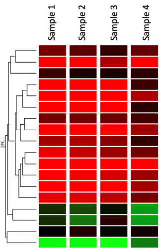

## Heatmaps

Here we discuss the basics of heatmaps and 3 R packages for generating heatmaps:


### Basics

  
  

A heatmap is a popular graphical method for visualizing high-dimensional data, in which a table of numbers are encoded as a grid of colored cell.  

Generating heatmaps is easy, but how do they work?  
  
- almost every heatmap function in R by default does the hierarchical clustering first, then scales the rows then displays the image  
  (In other words, the scale parameter inside the heatmap functions only plays a role in displaying the colors, but does not involve clustering)  
- Do you need to scale (center) your data before clustering?
- distance measure and linkage method can drastically affect your clustering
- by default Euclidean distance is used (correlation is often useful for clustering by similar shape) 

For a more detailed explantation check out [this blog entry](http://www.opiniomics.org/you-probably-dont-understand-heatmaps/)
 
### pheatmap

https://cran.r-project.org/web/packages/pheatmap/index.html  
  
- heatmaps with nice aesthetics
- annotations of rows and columns
- automatic generation of legends
- reasonable defaults


(Code: https://github.com/raivokolde/pheatmap)

#### Installation
install.packages(pheatmap)


-------------------------------------------
### heatmaply: interactive heatmaps

https://github.com/talgalili/heatmaply  

- interactive (.js) with zooming 
- also suitable for very large matrices (e.g. all genes)
- lots of examples with code

2 examples: [simple plot](https://cran.r-project.org/web/packages/heatmaply/vignettes/heatmaply.html) and [sample-sample correlation of all genes](https://cdn.rawgit.com/talgalili/heatmaplyExamples/master/inst/doc/biological_data.html#visualization-of-raw-and-voom-transformed-data-all-genes)

Many examples on:  
https://cran.r-project.org/web/packages/heatmaply/vignettes/heatmaply.html  
https://github.com/talgalili/heatmaply#usage  

#### Installation
install.packages('heatmaply')

----------------------------------------------

### superheat

Another frequently used package  

https://github.com/rlbarter/superheat  


## Interesting links

- [List of packages for generating heatmap in R](https://www.biostars.org/p/205417/)
- package for correlation heatmap: [corrplot](https://cran.r-project.org/web/packages/corrplot/vignettes/corrplot-intro.html)
- arrange multiple heatmaps and supports self-defined annotation graphics: [ComplexHeatmap](https://github.com/jokergoo/ComplexHeatmap)
- heatmaps with ggplot2: https://learnr.wordpress.com/2010/01/26/ggplot2-quick-heatmap-plotting/

## Sources

- http://rpubs.com/crazyhottommy/a-tale-of-two-heatmap-functions

## Exercises

### Heatmaps

1. Draw a heatmap of the following RNA-seq time course data for 4 different genes:
  Pick one package and modify the default settings to make the heatmap informative. Would you cluster the genes the same?
  ```{r}
expr <- matrix(c(1,3,1,3,4,2,4,2,8,15,8,15,15,10,15,10), ncol=4, byrow=TRUE)
rownames(expr) <- c("Gene A", "Gene B", "Gene C", "Gene D")
colnames(expr) <- c("0h", "12h", "24h", "36h")
```
2. Observe the gene clustering. Would you cluster the genes the same? Can you fix it?    
3. Generate the heatmap with some sample annotation:
```
my_sample_col <- data.frame(sample = rep(c("tumour", "normal"), times=2))
row.names(my_sample_col) <- colnames(expr)
pheatmap(expr, cluster_cols=FALSE, display_numbers=TRUE, annotation_col=my_sample_col)
```
4. It is easy to add some spaces to separate groups (here we want to have 2 sample clusters based on the hierarchical clustering)
```
pheatmap(expr, cluster_cols=FALSE, display_numbers=TRUE, annotation_col=my_sample_col, cutree_rows=2)
```


## Solutions

### Heatmaps

1. Draw a heatmap of the following RNA-seq time course data (normalized) for 4 different genes:
  Pick one package and modify the default settings to make the heatmap informative.
```{r} 
# Plot line plots
library(ggplot2)
library(reshape2)
ggplot(melt(expr), aes(Var2, value, group=Var1, col=Var1)) + geom_line()
# Plot heatmaps
library(pheatmap)
# absolute values, no scaling
pheatmap(expr, cluster_cols=FALSE, display_numbers=TRUE)
# relative values, scaling by row
pheatmap(expr, cluster_cols=FALSE, display_numbers=TRUE, scale="row")
2. Observe the gene clustering. Would you cluster the genes the same? Can you fix it?  
```{r}
# correlation (here Pearson on logged values) works well to cluster similar shapes/pattern
pheatmap(log2(expr+0.1), cluster_cols=FALSE, display_numbers=TRUE, scale="row", clustering_distance_rows="correlation")
```

